<a href="https://jaygautamportfolio.netlify.app">
  <picture>
    <source media="(prefers-color-scheme: dark)" srcset="assets/masthead-dark.svg">
    
  </picture>
</a>

 

AI & ML undergraduate (B.Tech CS, 2023–27). I build **LLM agents and RAG pipelines**, **computer-vision models**, and **applied ML** — and I care most about the evaluation: baselines, ablations, confidence intervals, and hand-built test sets that show where a model fails, not just where it shines.

 

### ◆ &nbsp;On the Kaggle leaderboard

<!-- KAGGLE:START -->
| Competition | Rank | Standing | Status |
|:--|--:|:-:|:--|
| **[ARC Prize 2026 - ARC-AGI-3](https://www.kaggle.com/competitions/arc-prize-2026-arc-agi-3)** | **#374** of 3,182 | Top 12% | Live · ends 02 Nov 2026 |
| **[RSNA Knee Abnormality Detection](https://www.kaggle.com/competitions/rsna-knee-abnormality-detection)** | **#755** of 4,030 | Top 19% | Live · ends 22 Oct 2026 |
| **[Kaggriculture](https://www.kaggle.com/competitions/kaggriculture)** | **#5,324** of 9,624 | Top 56% | Live · ends 30 Sep 2026 |

Public-leaderboard ranks, refreshed daily from the Kaggle API · last updated 20 Sep 2026
<!-- KAGGLE:END -->

 

### ◆ &nbsp;Flagship AI systems

<a href="https://github.com/jaygautam-creator/Aletheia"><picture><source media="(prefers-color-scheme: dark)" srcset="assets/card-aletheia-dark.svg"></picture></a>
<a href="https://rampbrain.com"><picture><source media="(prefers-color-scheme: dark)" srcset="assets/card-rampbrain-dark.svg"></picture></a>
<a href="https://github.com/jaygautam-creator/Dobara"><picture><source media="(prefers-color-scheme: dark)" srcset="assets/card-dobara-dark.svg"></picture></a>
<a href="https://github.com/jaygautam-creator/river"><picture><source media="(prefers-color-scheme: dark)" srcset="assets/card-river-dark.svg"></picture></a>

RampBrain is private — **[rampbrain.com](https://rampbrain.com)** is live, and I'm happy to give a walkthrough.

 

### ◆ &nbsp;More AI & ML work

| | Project | What it is |
|:-:|:--|:--|
| `05` | **[Support Triage Agent](https://github.com/jaygautam-creator/hiver-support-agent)** | LLM first-response agent for @AppleSupport built from 2.8M tweets — intent, grounded reply, and an escalation decision citing policy. The evaluation is the point: 5-fold CV with bootstrap CIs, a blind control, a second annotator, and ablations. |
| `06` | **[Dyla](https://github.com/jaygautam-creator/dyla-stump-the-model)** | Visual search for jewellery — CLIP embeddings + FAISS over 7,000+ catalogue photos, evaluated per condition on hand-shot hard phone photos. [Live →](https://frontend-neon-nine-bl3oyccpzz.vercel.app) |
| `07` | **[CuraLens](https://github.com/jaygautam-creator/CuraLens)** | Medical image screening — MobileNetV2 transfer-learning classifiers for oral and skin images with Grad-CAM heatmaps and risk scoring; 0.92–0.95 held-out validation AUC. |
| `08` | **[Real-Time Parking Detection](https://github.com/jaygautam-creator/real-time-faculty-parking)** | Computer-vision occupancy pipeline streamed to a live dashboard. Top 10 of 500+ at the IIT Madras Hackathon 2023. |

Also shipped: **[DealFlow360](https://github.com/jaygautam-creator/dealflow360)** (Odoo Hackathon 2026 finalist — top 350 of 20,000+) · **[Blackout Protocol](https://github.com/jaygautam-creator/Blackout-Protocol)** (offline mesh network) · **[Offline UPI Wallet](https://github.com/jaygautam-creator/offline-upi-wallet)** · [all repositories →](https://github.com/jaygautam-creator?tab=repositories)

 

### ◆ &nbsp;Toolkit

<picture>
  <source media="(prefers-color-scheme: dark)" srcset="assets/toolkit-dark.svg">
  
</picture>

**LLMs & agents** RAG · hybrid retrieval (pgvector) · LangGraph · MCP · Claude / Gemini / OpenAI APIs &nbsp;·&nbsp; **ML** scikit-learn · LightGBM · Pandas &nbsp;·&nbsp; **Vision** OpenCV · MobileNetV2 / EfficientNet · Grad-CAM · CLIP / FAISS &nbsp;·&nbsp; **Evaluation** CV & bootstrap CIs · baselines & ablations · calibration

 

---

<a href="https://jaygautamportfolio.netlify.app"><b>Portfolio</b></a> &nbsp;·&nbsp;
<a href="https://www.kaggle.com/jaygautam007">Kaggle</a> &nbsp;·&nbsp;
<a href="https://www.linkedin.com/in/jay-gautam-coder">LinkedIn</a> &nbsp;·&nbsp;
<a href="https://gautamjay.blogspot.com">Blog</a> &nbsp;·&nbsp;
<a href="https://twitter.com/jay_gautam__">X</a> &nbsp;·&nbsp;
<a href="mailto:jaygautam561@gmail.com">jaygautam561@gmail.com</a>

